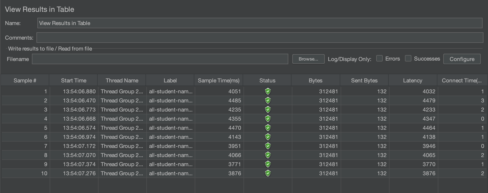
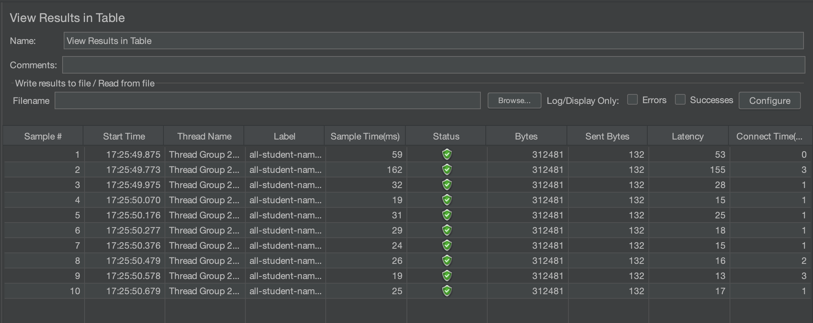
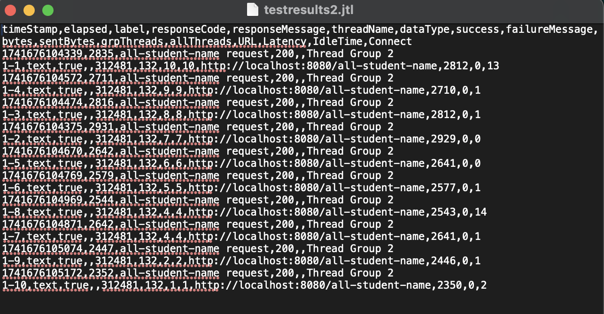
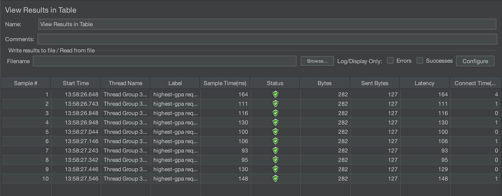
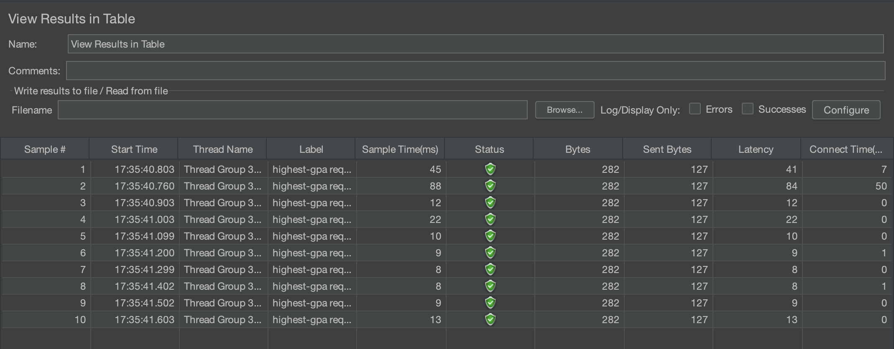
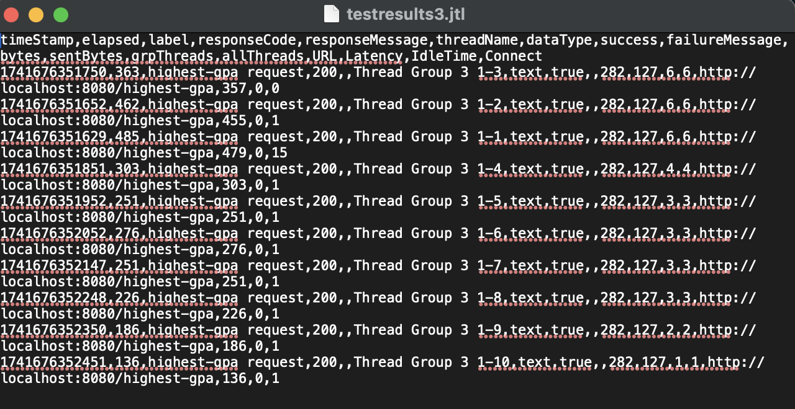

# Module 5

## `/all-student-name`
| Before Optimization           | After Optimization               | 
 |-------------------------------|----------------------------------|
|  |  |

#### Command Line

## `/highest-gpa`
| Before Optimization           | After Optimization               | 
 |-------------------------------|----------------------------------|
|  |  |

#### Command Line

### Conclusion

After making optimizations based on profiling results, we ran another performance test using JMeter. The results showed faster response times, lower CPU and memory usage, and better performance under load. The optimizations helped fix key bottlenecks, making the application run more efficiently.

---

## Reflection

### 1. Difference Between JMeter and IntelliJ Profiler
JMeter tests how well the system handles multiple users at once. It measures response times and finds performance issues under heavy load. IntelliJ Profiler, on the other hand, looks inside the application to find slow code, high CPU usage, and memory issues. JMeter helps test external performance, while IntelliJ Profiler helps improve internal code efficiency.

### 2. How Profiling Helps Find Weak Points
Profiling shows which parts of the code take the most time and use the most memory. This helps us spot slow functions, optimize database queries, and fix memory problems. Instead of guessing where the issues are, profiling gives real data to make smart improvements.

### 3. Is IntelliJ Profiler Effective?
Yes, IntelliJ Profiler is really helpful. It shows which methods are slow, where memory is being wasted, and what causes CPU spikes. This makes it easier to optimize the right parts of the code instead of making random changes.

### 4. Challenges in Performance Testing and Profiling
One challenge is that profiling can slow down the application, making results less accurate. Another issue is understanding the huge amount of data profiling provides. To deal with this, we run profiling in a controlled environment, focus on the most important data, and compare with JMeter results.

### 5. Benefits of Using IntelliJ Profiler
IntelliJ Profiler helps us quickly find and fix slow code, reduce memory usage, and improve app performance. It also helps prevent crashes and slowdowns before they happen by identifying issues early.

### 6. What If JMeter and IntelliJ Profiler Show Different Results?
If JMeter shows slow response times but profiling doesn’t, the issue might be database load or network delays. If profiling finds slow code but JMeter doesn’t, the issue only happens under heavy traffic. To solve this, we test under different conditions and check database and server logs.

### 7. How We Optimize Code Without Breaking Anything
To improve performance, we reduce unnecessary calculations, optimize database queries, and fix memory issues. Before making changes, we run tests to make sure everything still works. After optimization, we re-run JMeter tests to confirm the improvements.

